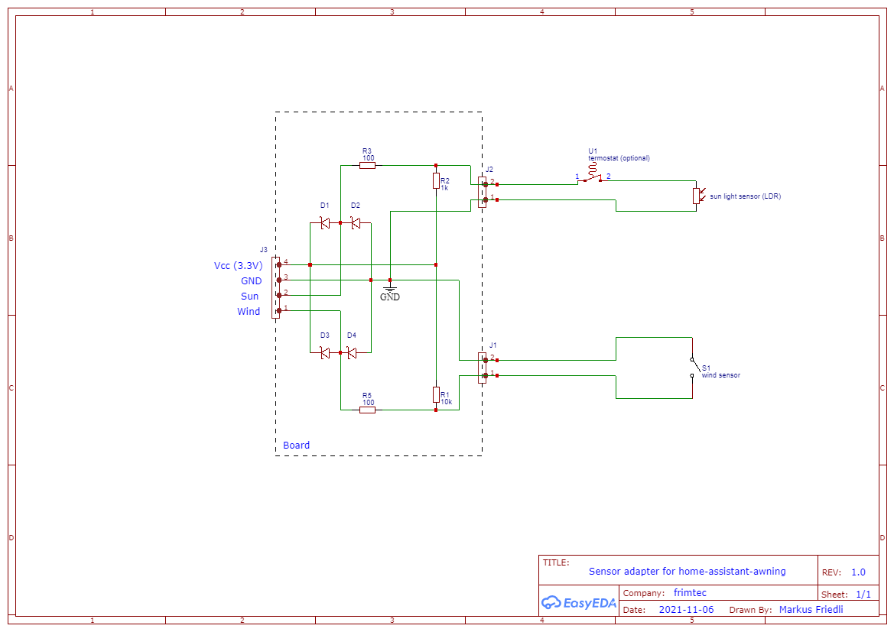

## Home Assistant Awning

[![License][license-shield]][license]

![Project Maintenance][maintenance-shield]

"Home Assistant Awning" can be used to manually build up a low cost but high functional awnings control system for the
home assistant platform.
Low cost at least if you already have the mechanical installation of the awnings including the motors to move them.

In my case I control two independent awnings for the south and the west side of my winter garden. The installation is
already over 20 years old and the controller was a closed system not offering any connectivity.


Each awning is moved with a retractable awning motor having an 240V AC input for expand and one for retract.
The retractable awning motors are controlled by a [Zigbee blinds actuator from NEXENTRO][nexentro-documentation].

On the top of the winter garden two sensors are mounted:
* Sunlight sensor (LDR - Light Dependent Resistor)
* Mechanical wind sensor (simple impuls output)


A thermostat located in the winter garden can open and close the wire to the sunlight sensor.
If the temperatur threshold of the thermostat is reached, the wire is closed.

The scope of this project is the low power hardware and the configuration to integrate the sensors and awning actuator into
a home assistent instance.

---
**SAFTY WARNING**

**Be aware that the installation of the awnings motors must be done by a trained electrician!**<br>
Don't risk your life or burn down the house.
---

## Hardware

The hardware consists of two parts:
* Sensor adapter board
* ESP32 with status LED

### Bill of material
* 1 x [Node MCU ESP32][conrad-esp32]
* 1 x [RGB LED][conrad-rgb-led]
* 4 x [Schottky Diodes][conrad-schottky-diode]
* 2 x [100 Ohm resistor][conrad-100-resistor]
* 4 x [1k Ohm resistor][conrad-1k-resistor]
* 1 x [10k Ohm resistor][conrad-10k-resistor]
* 2 x [2 or 3 pin connector][conrad-connector]
* 1 x [4 pin header][conrad-4pin-header]
* 8 x [Jumper cable][conrad-jumper-cable]
* 1 x [Circuit board][conrad-board]
* 3D printed case (see the [case](/case) folder)

### Sensor adapter board


The sensor adapter board is quite simple and can be wired best on a [Circuit board][conrad-board] according the given schema.
The schottky diodes (SMD diodes) mounted on the backside, require good eyesight and a steady hand.
The diodes are important to protect the GPIO pins of the ESP32 from over or under volatge coming in via spikes over the potential long sensor wires.

The components placed on the board are:
* J1: Connector to the wind sensor
* J2: Connector to the sunlight sensor (with optional thermostat)
* J3: Connector to the ESP32
* R1: 10k ohm resistor
* R2: 1k ohm (or other depending on the sunlight sensor LDR)
* R3, R5: 100 ohm resistors
* D1-D4: Fast schottky diodes with low forward volatge (e.g. Infineon BAT60A SOD-323-2 10 V)




### ESP32 with status LED


The ESP32 including the RGB-LED fits perfectly into the [case](/case) that can be 3D printed.

### Wiring instruction

#### Sensor adapter board
The wiring can be done best with jumper cabels (e.g. [jumper-cable][conrad-jumper-cable]).

| Sensor adapter board | ESP32        |
|----------------------|--------------|
| VCC                  | 3V3          |
| GND                  | GND          |
| SUN                  | A32 (GPIO32) |
| WIND                 | D13 (GPIO13) |

#### RGB LED
It is advisable to add a resistor of about 1k Ohm between each color pin of the RGB-LED and the ESP32 GPIO pin.
Your best bet is to use a small piece of the circuit board.

| LED    | ESP32      |
|--------|------------|
| RED    | D2 (GPIO2) |
| GREEN  | D4 (GPIO4) |
| BLUE   | D5 (GPIO5) |
| GND    | GND        |

#### Flash ESP32

Once you've connected all the hardware, we'll get started with the configuration for [ESPHome][esphome].

In this repository you will find the file [esphome/frimtec-awning-sensors.yaml][file],
which you can copy into the `esphome` folder of your Home Assistant config.
Finally go through the installation wizard of ESPHome and flash the ESP32.

## Configuration
The automations to control the awnings are prepared in blueprints.

First copy the complete folder structure [blueprints](/blueprints) into your Home Assistant config folder.


### Awning sensor automations
Create two automations to integrate the sensor board from the blueprint [awning-sensor.yaml](/blueprints/automation/frimtec/awning-sensor.yaml)
as follows, using threshold values and times as desired for your sensors:

| Name               | Sensor                          | State light                  |
|--------------------|---------------------------------|------------------------------|
| Awning Sensor Sun  | sensor.awning_sensor_sun_light  | Awning Sensor - Status Green |
| Awning Sensor Wind | sensor.awning_sensor_wind_speed | Awning Sensor - Status Red   |

### Awning control automations
Create an automation for each awning to control.
Use the blueprint [awning-control.yaml](/blueprints/automation/frimtec/awning-control.yaml)
as follows:

| Field               | Value                             |
|---------------------|-----------------------------------|
| Name                | Use a name to identify the awning | 
| Sun state sensor    | light.awning_sensor_status_green  | 
| Wind state sensor   | light.awning_sensor_status_red    | 
| Awning              | Select awning entity to control   |
| Min/Max sun azimuth | Define Min/Max sun azimuth        |


### Calibrate the wind sensor
The wind sensor reports the wind speed in km/h.
To have accurate results two characteristics of the used cup anemometer needs to be configured in the home assistant device:
* radius: cup anemometer radius in millimeter (default value: 38 mm)
* impulses_per_rotation: cup anemometer impulses per full rotation (default value: 1)

The wind speed is measured as impulses per minute (x) and then converted into km/h with the following formula:
```
v = x * ((2 * Pi * radius * 60) / (impulses_per_rotation * 1'000'000))   
```

### Calibrate the sunlight sensor
The sunlight sensor reports the illuminance in lux.
To have accurate results the measured value from the ADC can be adjusted by two parameters 'sunlight_additive' and 'sunlight_multiplicative'.
The illuminance is calculated with the following formula:
```
i = (x + sunlight_additive) * sunlight_multiplicative   
```
Negative values are clipped to zero.

### Example Dashboard


# Credits
* [klaasnicolaas][github-klaasnicolaas] for the 3D case provided in [home-assistant-glow][home-assistant-glow]


[file]: /esphome/frimtec-awning-sensors.yaml
[maintenance-shield]: https://img.shields.io/maintenance/yes/2024.svg
[license-shield]: https://img.shields.io/github/license/frimtec/home-assistant-awning.svg
[license]: https://opensource.org/licenses/Apache-2.0
[nexentro-documentation]: https://cdn.competec.ch/documents2/4/5/5/194267554/194267554.pdf
[esphome]: https://esphome.io
[github-klaasnicolaas]: https://github.com/klaasnicolaas
[home-assistant-glow]: https://github.com/klaasnicolaas/home-assistant-glow
[conrad-esp32]: https://www.conrad.ch/de/p/joy-it-entwickler-platine-node-mcu-esp32-modul-1656367.html
[conrad-rgb-led]: https://www.conrad.ch/de/p/kingbright-l-154a4surkqbdzgw-led-mehrfarbig-rot-blau-gruen-rund-5-mm-200-mcd-300-mcd-1300-mcd-60-20-ma-1-95-v-3-3-1050466.html
[conrad-board]: https://www.conrad.ch/de/p/rademacher-wr-typ-710-2-platine-hartpapier-l-x-b-100-mm-x-75-mm-35-m-rastermass-2-54-mm-inhalt-1-st-529531.html
[conrad-jumper-cable]: https://www.conrad.ch/de/p/joy-it-rb-cb3-025-jumper-kabel-raspberry-pi-banana-pi-arduino-20x-drahtbruecken-buchse-20x-drahtbruecken-buchse-25-0-1182193.html
[conrad-4pin-header]: https://www.conrad.ch/de/p/connfly-stiftleiste-standard-anzahl-reihen-1-polzahl-je-reihe-40-ds1021-1-40sf11-1-st-1390109.html
[conrad-schottky-diode]: https://www.conrad.ch/de/p/infineon-technologies-schottky-diode-gleichrichter-bat60a-sod-323-2-10-v-einzeln-tape-cut-154027.html
[conrad-100-resistor]: https://www.conrad.ch/de/p/yageo-cfr-25jt-52-100r-kohleschicht-widerstand-100-axial-bedrahtet-0207-0-25-w-5-1-st-1417639.html
[conrad-1k-resistor]: https://www.conrad.ch/de/p/yageo-cfr-25jt-52-1k0-kohleschicht-widerstand-1-k-axial-bedrahtet-0207-0-25-w-5-1-st-1417699.html
[conrad-10k-resistor]: https://www.conrad.ch/de/p/yageo-cfr-25jt-52-10k-kohleschicht-widerstand-10-k-axial-bedrahtet-0207-0-25-w-5-1-st-1417697.html
[conrad-connector]: https://www.conrad.ch/de/p/te-connectivity-282837-3-schraubklemmblock-1-40-mm-polzahl-num-3-gruen-1-st-1421685.html?gclid=CjwKCAjwzaSLBhBJEiwAJSRokh-6w8SD5mRbWpBqTB3dXs7ZV1in-iJpRmjEg686jQaoJfRHSNdqnBoCJiMQAvD_BwE&utm_source=google-shopping-de&utm_medium=search&utm_campaign=shopping-online-de&utm_content=shopping-ad_cpc&WT.srch=1&ef_id=CjwKCAjwzaSLBhBJEiwAJSRokh-6w8SD5mRbWpBqTB3dXs7ZV1in-iJpRmjEg686jQaoJfRHSNdqnBoCJiMQAvD_BwE%3AG%3As
