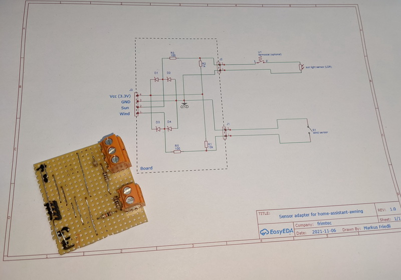

## Home Assistant Awning 

---
**INFO**

This project is still under construction !

---

"Home Assistant Awning" can be used to manually build up a low cost but high functional awnings control system for the
home assistant platform.
Low cost at least if you already have the mechanical installation of the awnings including the motors to move them.

In my case I control two independent awnings for the south and the west side of my winter garden. The installation is
already over 20 years old and the controller was a closed system not offering any connectivity.

Each awning is moved with a retractable awning motor having an 240V AC input for expand and one for retract.
The retractable awning motors are controlled by a [Zigbee blinds actuator from NEXENTRO](https://cdn.competec.ch/documents2/4/5/5/194267554/194267554.pdf).

On the top of the winter garden two sensors are mounted:
* Sunlight sensor (LDR - Light Dependent Resistor)
* Mechanical wind sensor (simple impuls output)

A thermostat located in the winter garden can open and close the wire to the sunlight sensor.
If the temperatur threshold of the thermostat is reached, the wire is closed.

The scope of this project is the low power hardware and the configuration to integrate the sensors and awning actuator into 
a home assistent instance.

---
**SAFTY WARNING**

**Be aware that the installation of the awnings motors must be done by a trained electrician!** 
Don't risk your life or burn down the house.
---

## Hardware

The hardware consists of two parts:
* Sensor adapter board
* ESP32 with status LED

### Bill of material
* 1 x [Node MCU ESP32](https://www.conrad.ch/de/p/joy-it-entwickler-platine-node-mcu-esp32-modul-1656367.html)
* 1 x [RGB LED](https://www.conrad.ch/de/p/kingbright-l-154a4surkqbdzgw-led-mehrfarbig-rot-blau-gruen-rund-5-mm-200-mcd-300-mcd-1300-mcd-60-20-ma-1-95-v-3-3-1050466.html)
* 3 x [470 Ohm resistor](https://www.conrad.ch/de/p/yageo-cfr-25jt-52-10k-kohleschicht-widerstand-10-k-axial-bedrahtet-0207-0-25-w-5-1-st-1417697.html)
* 1 x [10k Ohm resistor](https://www.conrad.ch/de/p/yageo-cfr-25jt-52-470r-kohleschicht-widerstand-470-axial-bedrahtet-0207-0-25-w-5-1-st-1417694.html)
* 1 x [50k Ohm trimmer](https://www.conrad.ch/de/p/weltron-wel3296-w-503-lf-spindeltrimmer-25-gang-in-line-linear-0-5-w-50-k-9000-1-st-447592.html) 
* 2 x [2 or 3 pin connector](https://www.conrad.ch/de/p/te-connectivity-282837-3-schraubklemmblock-1-40-mm-polzahl-num-3-gruen-1-st-1421685.html?gclid=CjwKCAjwzaSLBhBJEiwAJSRokh-6w8SD5mRbWpBqTB3dXs7ZV1in-iJpRmjEg686jQaoJfRHSNdqnBoCJiMQAvD_BwE&utm_source=google-shopping-de&utm_medium=search&utm_campaign=shopping-online-de&utm_content=shopping-ad_cpc&WT.srch=1&ef_id=CjwKCAjwzaSLBhBJEiwAJSRokh-6w8SD5mRbWpBqTB3dXs7ZV1in-iJpRmjEg686jQaoJfRHSNdqnBoCJiMQAvD_BwE%3AG%3As)
* 1 x [4 pin header](https://www.conrad.ch/de/p/connfly-stiftleiste-standard-anzahl-reihen-1-polzahl-je-reihe-40-ds1021-1-40sf11-1-st-1390109.html)
* 8 x [Jumper cable](https://www.conrad.ch/de/p/joy-it-rb-cb3-025-jumper-kabel-raspberry-pi-banana-pi-arduino-20x-drahtbruecken-buchse-20x-drahtbruecken-buchse-25-0-1182193.html)
* 1 x [Circuit board](https://www.conrad.ch/de/p/rademacher-wr-typ-710-2-platine-hartpapier-l-x-b-100-mm-x-75-mm-35-m-rastermass-2-54-mm-inhalt-1-st-529531.html) 
* 3D printed case (see the [case](/case) folder)

### Sensor adapter board

TODO: Schema

### ESP32 with status LED

The ESP32 including the RGB-LED fits perfectly into the [case](/case) that can be 3D printed. 

### Wiring instruction 

#### Sensor adapter board
The wiring can be done best with jumper cabels (e.g. [jumper-kabel](https://www.conrad.ch/de/p/joy-it-rb-cb3-025-jumper-kabel-raspberry-pi-banana-pi-arduino-20x-drahtbruecken-buchse-20x-drahtbruecken-buchse-25-0-1182193.html)).

| Sensor adapter board | ESP32        |
|----------------------|--------------|
| VCC                  | 3V3          |
| GND                  | GND          |
| SUN                  | A32 (GPIO32) |
| WIND                 | D12 (GPIO12) |

#### RGB LED
It is advisable to add a resistor of about 470 Ohm between each color pin of the RGB-LED and the ESP32 GPIO pin.
Your best bet is to use a small piece of the circuit board.

| LED    | ESP32      |
|--------|------------|
| RED    | D2 (GPIO2) |
| GREEN  | D4 (GPIO4) |
| BLUE   | D5 (GPIO5) |
| GND    | GND        |

#### Flash ESP32

Once you've connected all the hardware, we'll get started with the configuration for [ESPHome](https://esphome.io).

In this repository you will find the file [esphome/frimtec-awning-sensors.yaml][file], 
which you can copy into the `esphome` folder of your Home Assistant config. 
Finally go through the installation wizard of ESPHome and flash the ESP32.

## Configuration
TODO

# Credits
* [klaasnicolaas](https://github.com/klaasnicolaas) for the 3D case provided in [home-assistant-glow](https://github.com/klaasnicolaas/home-assistant-glow)

[file]: /esphome/frimtec-awning-sensors.yaml
